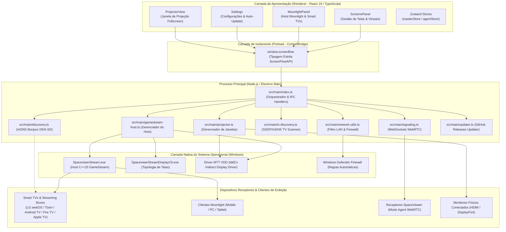

# SpaceViewer

> **Central de Transmissão, Extensão de Telas e Espelhamento de Alta Performance em Rede Local.**  
> Versão Atual: **v2.2.18** · Licença: **MIT** · Plataforma Alvo: **Windows 10/11 (x64)**

---

## Sumário Executivo e Visão Geral

O **SpaceViewer** é uma solução de engenharia de software desenvolvida para transmissão de vídeo de ultra baixa latência, extensão de monitores virtuais e espelhamento em rede local (LAN). O aplicativo opera como uma central unificada que combina:

1. **Extensor de Área de Trabalho Otimizado (Tela Virtual Única)**: Criação sob demanda de 1 tela virtual estendida de alta performance no Windows via driver IddCx (*Indirect Display Driver* MTT VDD), espelhada simultaneamente para todos os dispositivos Moonlight conectados. Essa arquitetura elimina a sobrecarga de múltiplas codificações paralelas, reduzindo drasticamente o consumo de GPU/CPU e estabilizando a rede local.
2. **Servidor GameStream / Moonlight Nativo**: Host C++20 embarcado de alto desempenho (`SpaceviwerStream.exe`) com captura DXGI e codificação H.264 via Media Foundation (hardware quando disponível, com alternativa por software), permitindo que Smart TVs (LG webOS, Samsung Tizen, Android TV, Google TV, Apple TV e Fire TV) e dispositivos móveis atuem como monitores estendidos ou espelhados sem cabos.
3. **Projeção Seletiva de Aplicativos ("Transmitir Aplicativo")**: Captura direta de janelas individuais de programas em execução no Windows (navegadores, planilhas, softwares corporativos, jogos) e projeção em tela cheia na tela física ou virtual de destino, mantendo a área de trabalho livre para outras atividades.
4. **Espelhamento P2P WebRTC (Master/Agent)**: Pipeline de streaming bidirecional em tempo real com codecs H.264/VP8/VP9, áudio estéreo em tempo real e sinalização baseada em WebSockets.
5. **Autodescoberta mDNS / DNS-SD por Hostname**: Anúncio automático do computador na sub-rede por meio de seu nome de host real (`os.hostname()`), eliminando a necessidade de configuração manual de endereços IP nos clientes Moonlight.
6. **Sistema de Auto-Update Integrado**: Verificação, download assíncrono com barra de progresso em tempo real e atualização *in-place* com base nos lançamentos do GitHub Releases.

---

## Arquitetura Geral do Sistema

A aplicação foi desenvolvida sobre o framework **Electron 30**, utilizando **TypeScript**, **React 19**, **Tailwind CSS v4** e um binário auxiliar de streaming compilado em **C++20**.



---

## Módulos Técnicos do Código

### 1. Processo Principal (`src/main/`)

- **`index.ts`**:
  - Ponto de entrada do executável Electron. Inicializa o ciclo de vida da aplicação (`app.whenReady`).
  - Configura a janela principal sem moldura (*frameless window*) com acelerador de hardware desabilitado para WebRTC IP masking (`disable-features=WebRtcHideLocalIpsWithMdns`).
  - Inicializa concorrentemente:
    1. Ajuste de perfil de rede do Windows de Público para Privado (`ensurePrivateNetworkProfile`).
    2. Servidor GameStream nativo (`startHost()`) com disparo automático.
    3. Mecanismo mDNS Bonjour (`publishMaster`).
    4. Scanner de Smart TVs na sub-rede (`TVDiscovery`).
    5. Servidor de sinalização WebSockets para agentes WebRTC (`SignalingServer`).
    6. Observador de solicitações de pareamento PIN com ativação da janela principal em primeiro plano (`startPairingWatcher`).
  - Registra mais de 30 handlers de comunicação IPC (`ipcMain.handle`).

- **`gamestream-host.ts`**:
  - Controla o ciclo de vida do binário nativo `resources/spaceviwerstream/SpaceviwerStream.exe`.
  - Inicia o processo nativo utilizando o argumento estrito `['--host']` com pipes de stdio redirecionados e janela oculta (`windowsHide: true`).
  - Conecta-se à Loopback API interna (`127.0.0.1:47990/api/status`) para validação de integridade do servidor HTTP/HTTPS, porta de pareamento e estatísticas.
  - Interage com o driver de display virtual `MttVDD` via chamadas PowerShell/PnP:
    - Executa `pnputil /restart-device` e `/enable-device` para instâncias `ROOT\SPACEVIWERSTREAM_VIRTUAL_DISPLAY\0000`, `ROOT\SENAISTREAM_VIRTUAL_DISPLAY\0000` e `SWD\MTT_VDD\0000`.
    - Executa `SpaceviwerStreamDisplayCtl.exe [extend|duplicate]` para comutação de topologia no Windows Display Manager.
  - Mantém a sincronização de certificados de clientes autorizados no diretório oficial `%LOCALAPPDATA%\SpaceViewer\clients`.

- **`discovery.ts`**:
  - Implementa a publicação de serviços DNS-SD / mDNS utilizando `bonjour-service`.
  - **Correção Crítica de Probe**: Executa todas as publicações de serviço com `probe: false`. No Windows, a sondagem padrão de rede causava falso positivo de colisão de pacotes locais, cancelando o registro e impedindo a descoberta.
  - Publica o computador com os seguintes alvos na porta 47989:
    1. **Alvo Primário por Hostname**: `name: cleanHost` (`_nvstream._tcp`), permitindo que clientes Moonlight encontrem o computador pelo nome exato do PC.
    2. **Identidade de Marca**: `name: SpaceViewer - ${cleanHost}` (`_nvstream._tcp`).
    3. **Compatibilidade Ampla**: `name: spacedesk - ${cleanHost}` (`_nvstream._tcp`).
    4. **Canal de Debug**: `name: cleanHost` (`_nvstream_dbg._tcp`).
    5. **Espelhamento SpaceViewer Master**: `name: SpaceViewer-${name}` (porta 7523).
  - Executa re-anúncio periódico a cada 10 segundos chamando ativamente `mdnsServer.respond()`.

- **`network-utils.ts`**:
  - Realiza varredura nas interfaces de rede do sistema (`os.networkInterfaces()`).
  - Filtra e descarta automaticamente adaptadores virtuais de máquinas virtuais e VPNs:
    - VirtualBox (`192.168.56.x`, endereços MAC iniciando em `0a:00:27` ou `08:00:27`).
    - VMware, pseudo-interfaces e loopback.
    - Endereços APIPA (`169.254.x.x`).
  - Garante que apenas o IPv4 físico da rede local cabeada ou Wi-Fi seja publicado.
  - Injeta regras no Firewall do Windows (`New-NetFirewallRule`) para liberação das portas TCP e UDP necessárias para streaming e descoberta.

- **`projector.ts`**:
  - Gerencia o módulo "Transmitir Aplicativo".
  - Cria janelas secundárias Electron (`BrowserWindow`) sem bordas, transparentes ou em tela cheia, alinhadas rigorosamente às coordenadas e métricas da tela de destino (`screen.getAllDisplays()`).
  - Suporta roteamento hash de assets em builds empacotados (`.asar`), garantindo compatibilidade com o instalador de produção.

- **`tv-discovery.ts`**:
  - Motor assíncrono de descoberta de dispositivos Smart TV na rede local.
  - Combina broadcast SSDP (UDP 1900), mDNS (UDP 5353) e verificação de portas TCP de serviços de TV:
    - LG webOS (portas 3000 / 3001).
    - Samsung Tizen (portas 8001 / 8002).
    - Android TV / Google TV (portas 6466 / 6467).
    - Moonlight Clients (portas 47989 / 47984 / 48010).

- **`updater.ts`**:
  - Módulo de atualização automática conectado à API pública de lançamentos do repositório GitHub (`admregionalvitoria-sudo/spaceviwer`).
  - Compara a versão atual (`package.json`) com a tag mais recente (`vX.Y.Z`).
  - Realiza o download do instalador `SpaceViewer-Setup-X.Y.Z.exe` em chunks de stream HTTPS com cálculo de velocidade média e bytes transferidos, disparando a execução do instalador NSIS ao concluir.

---

### 2. Camada de Isolamento (`src/preload/index.ts`)

Fornece a interface `window.screenflow` segura e isolada pelo `contextBridge` com tipagem TypeScript completa (`ScreenFlowAPI`), expondo métodos para:
- Gerenciamento de telas e janelas de aplicativos.
- Controle do servidor Moonlight e pareamento por PIN.
- Adição, remoção e alternância de telas virtuais.
- Consulta de informações de rede e nome de host (`getHostInfo`).
- Verificação e aplicação de atualizações do aplicativo.

---

### 3. Interface do Usuário (`src/renderer/`)

- **`ScreensPanel.tsx` (Painel Principal de Telas)**:
  - Exibe o grid de monitores conectados em tempo real (monitores físicos integrados, monitores externos HDMI/DisplayPort e telas virtuais ativas).
  - Permite identificar a tela principal (*Primary Display*), posição no espaço e resolução nativa com escala DPI.
  - **Adição Dinâmica de Telas Virtuais**:
    - Card dedicado no final do grid com botão estilizado `+` para criar uma nova tela virtual sem precisar acessar outras telas.
    - Menu de Contexto (botão direito do mouse) em qualquer monitor ou na área livre do painel, permitindo adicionar ou remover telas virtuais.
    - Botão direto "Remover" no cabeçalho dos cartões de telas virtuais.
  - **Modal de Transmissão de Aplicativo**:
    - Lista em tempo real todas as janelas ativas do Windows com seus respectivos ícones e títulos.
    - Permite selecionar a janela e a tela de destino para projeção imediata.

- **`MoonlightPanel.tsx` (Painel de Transmissão Moonlight & Extensor)**:
  - Exibe o status do host nativo em tempo real (`Host Ativo (Pronto)` vs `Host Parado`).
  - **Auto-Start**: Inicia automaticamente o servidor Moonlight em segundo plano no carregamento caso o serviço esteja inativo.
  - Lista Smart TVs e clientes detectados na rede local categorizados por marca e sistema operacional (LG webOS, Samsung Tizen, Android TV, Fire TV, Apple TV).
  - Campo interativo para inserção do código PIN de 4 dígitos gerado pelo Moonlight na TV para pareamento instantâneo.
  - Alternador de topologia entre **Tela Estendida Independente** e **Tela Duplicada / Espelhamento**.
  - Caixa de identificação com o **Nome no Moonlight (Hostname do Computador)** e o **Endereço IP Local**.

- **`Settings.tsx`**:
  - Configurações de taxa de quadros (30 FPS, 60 FPS, 120 FPS), resolução de captura e compressão de vídeo.
  - Aba de **Atualização do Aplicativo** com verificação manual, download transparente e botão de reinicialização para aplicação de novas versões.

---

## Tabela de Portas e Protocolos de Rede

O SpaceViewer e seu host nativo utilizam os seguintes canais de comunicação:

| Porta | Protocolo | Direção | Finalidade Técnica |
| :--- | :--- | :--- | :--- |
| **47989** | TCP | Entrada | Servidor HTTP GameStream (rota `/serverinfo`, `/pair`, `/applist`) |
| **47984** | TCP | Entrada | Servidor HTTPS GameStream (autenticação segura e túnel de controle) |
| **47990** | TCP | Loopback | API interna de controle do host nativo (`127.0.0.1`) |
| **48010** | TCP | Entrada | Canal de sinalização e controle Moonlight RTSP |
| **47998** | UDP | Entrada/Saída | Stream de vídeo em tempo real (RTP / H.264 / HEVC) |
| **47999** | UDP | Entrada/Saída | Pacotes de controle de fluxo e feedback de latência (RTCP) |
| **48000** | UDP | Entrada/Saída | Stream de áudio digital em tempo real (Opus / PCM) |
| **48010** | UDP | Entrada/Saída | Descoberta ativa e ping de broadcast de clientes Moonlight |
| **5353** | UDP | Entrada/Saída | Descoberta de serviços mDNS / DNS-SD (Bonjour) |
| **1900** | UDP | Entrada/Saída | Descoberta de Smart TVs e dispositivos UPnP / SSDP |
| **7523** | TCP | Entrada | Servidor de Sinalização WebRTC e API de Espelhamento Master |
| **7524** | TCP | Entrada | Servidor de Recepção de Conexão no modo Agent |

---

## Regras Mandatórias de Interface e Design System

Para assegurar o nível de excelência visual, consistência tipográfica e acabamento profissional do SpaceViewer, as seguintes regras são rigorosamente aplicadas em todo o ecossistema:

1. **PROIBIDO O USO DE EMOJIS NO APLICATIVO**:
   - **Nenhum caractere de emoji (Unicode) é permitido na interface do usuário.**
   - Todos os elementos visuais, indicadores de status, botões e abas devem utilizar exclusivamente **ícones vetoriais modernos em SVG**.

2. **ÍCONE DO MOONLIGHT PADRONIZADO**:
   - Toda referência ao Moonlight (barra de navegação, painéis laterais, cartões e cabeçalhos) deve exibir a silhueta da **lua crescente vetorial limpa em SVG**.

3. **DESIGN SYSTEM GLASSMORPHISM**:
   - Componente base `GlassCard` com desfoque de fundo (`backdrop-blur-md`), bordas translúcidas sutis e paleta neutra com contraste elevado.
   - Indicadores funcionais nas tonalidades esmeralda (ativo/online), âmbar (atenção/duplicado) e ciano (conexões moonlight).

4. **REGISTRO TÉCNICO DE ATUALIZAÇÕES**:
   - Toda e qualquer modificação de código, melhoria arquitetural ou nova release deve ser formalmente descrita no histórico de versões deste documento.

---

## Histórico de Atualizações (Changelog)

### [v2.2.12] — 10 de Setembro de 2026
- **Inicialização Automática do Host Moonlight**:
  - O servidor GameStream nativo `SpaceviwerStream.exe` agora é iniciado automaticamente no arranque do SpaceViewer sem depender de ação do usuário.
  - Implementada verificação automática com recuperação em segundo plano no carregamento do painel Moonlight.
- **Descoberta no Moonlight por Hostname do Computador**:
  - Configurada a publicação prioritária do serviço `_nvstream._tcp` com o nome de host do sistema (`os.hostname()`).
  - Adicionado `probe: false` no `bonjour-service`, prevenindo o cancelamento do registro mDNS gerado por reflexão de broadcast no Windows.
  - Implementado re-anúncio mDNS ativo a cada 10 segundos via `mdnsServer.respond()`.
- **Eliminação Completa de Referências Legadas**:
  - Binário nativo atualizado para responder na rota `/serverinfo` com a identidade nativa `<hostname>SpaceViewer - [HOSTNAME]</hostname>`, eliminando resquícios de identificações anteriores no aplicativo cliente da TV.
  - Centralização e sincronização contínua de certificados de clientes pareados em `%LOCALAPPDATA%\SpaceViewer\clients`.
- **Correção no Spawn do Binário**:
  - Remoção de passagem de argumentos de configuração de arquivo no processo filho, mantendo a chamada estrita de `--host` que evita códigos de saída de encerramento inesperado.

---

### [v2.2.8]
- **Adição e Remoção de Telas Virtuais na Interface de Usuário**:
  - Card interativo com botão `+` integrado ao grid de monitores para criação direta de novas telas virtuais.
  - Menu de contexto acionado pelo botão direito do mouse em qualquer tela ou área livre do gerenciador de monitores.
  - Botão dedicado de exclusão no cabeçalho de cartões de telas virtuais.
- **Otimização do Driver Windows PnP**:
  - Implementação de enumeração profunda de instâncias de hardware virtual (`ROOT\SPACEVIWERSTREAM_VIRTUAL_DISPLAY`, `ROOT\SENAISTREAM_VIRTUAL_DISPLAY`, `SWD\MTT_VDD`).
  - Reinicialização dinâmica de driver via `pnputil` para atualização instantânea da topologia no Windows sem congelamentos de vídeo.

---

### [v2.2.1]
- **Design System Zero-Emoji**:
  - Substituição integral de todos os caracteres Unicode de emojis por ícones SVG geométricos e vetorizados.
- **Padronização do Ícone Moonlight**:
  - Aplicação unificada da lua crescente vetorial no menu inferior, barra lateral e cards de tela.
- **Auto-Update Integrado**:
  - Aba de atualização com conexão à API de Releases do GitHub, cálculo de velocidade de download em tempo real e atualização *in-place*.
- **Transmissão Seletiva de Aplicativos**:
  - Captura isolada de janelas do sistema operacional com envio para telas secundárias ou virtuais.

---

### [v2.2.0]
- **Driver de Display Virtual MTT VDD**:
  - Suporte completo a criação de monitores virtuais independentes através do driver IddCx integrado.
- **Servidor GameStream C++20 Nativo**:
  - Integração do host embarcado com codificação por GPU (NVENC/AMF/QuickSync) e suporte a pareamento por PIN de 4 dígitos.

---

## Instruções de Compilação e Execução

### Pré-requisitos
- **Sistema Operacional**: Windows 10 ou Windows 11 (64-bit).
- **Node.js**: Versão 18.x, 20.x ou superior.
- **Gerenciador de Pacotes**: npm (incluso com o Node.js).
- **Compilador C++ (Opcional)**: Visual Studio 2022 ou MSVC v143 caso deseje recompilar os binários nativos auxiliares.

### Instalação de Dependências
```bash
npm install
```

### Execução em Modo de Desenvolvimento
```bash
npm run dev
```

### Verificação de Tipos TypeScript
```bash
npm run typecheck
```

### Compilação do Código de Produção
```bash
npm run build
```

### Geração do Instalador Executável para Windows (.exe)
```bash
npm run package:win
```
*O instalador final será gerado no diretório `dist-package/SpaceViewer-Setup-X.Y.Z.exe`.*

### Publicação de Nova Release no GitHub
Para gerar uma nova release com upload automatizado do instalador para o repositório oficial:
```bash
node scripts/create_release.js
```

---

## Repositório Oficial e Suporte

- **Repositório GitHub**: [https://github.com/admregionalvitoria-sudo/spaceviwer](https://github.com/admregionalvitoria-sudo/spaceviwer)
- **Equipe de Desenvolvimento**: SpaceViewer Engineering Team
- **Licença de Uso**: Licença MIT (Consulte o arquivo `LICENSE` para detalhes).


## Servidor integrado 2.2.11

O código usado para gerar o servidor está em `native/spaceviwerstream`, importado do projeto independente SenaiStream fornecido pelo usuário. O aplicativo não executa nem instala Sunshine. Os namespaces originais e avisos de terceiros foram preservados. O executável embarcado é recompilado antes de gerar cada instalador; `resources/spaceviwerstream/build-manifest.json` registra os hashes dos fontes e binários.

### Compilar no Windows

Instale Node.js e MSYS2 em `C:\msys64`, com UCRT64 CMake, Ninja, GCC, pkg-config, OpenSSL e Opus. ENet e GoogleTest estão em `native/spaceviwerstream/third_party`.

```powershell
npm ci
npm run typecheck
npm run test:host
npm run package:win
```

`npm run build:native` compila o host, o controlador de telas e executa os testes C++. Para o teste adicional que captura vídeo real do monitor, execute no terminal UCRT64:

```sh
SPACEVIEWER_TEST_CAPTURE=1 cmake-build-spaceviewer/tests/test_sunshine.exe --gtest_filter=LiveSessions.*
```

### Operação

- Inicie o host na interface, adicione o IP do computador no Moonlight e confirme o PIN mostrado pela TV.
- Até quatro clientes com endereços IPv4 distintos na LAN têm sessões independentes. A capacidade real de codificação depende do computador.
- Com as TVs conectadas, use **Tela enviada para cada TV** para escolher um monitor por cliente. Clientes que usam a mesma tela compartilham uma captura, com codificadores separados.
- As mudanças de captura reiniciam somente o vídeo; controle e áudio permanecem conectados. Pode ocorrer uma breve pausa durante a reconstrução do codificador.
- Criar/remover telas altera o dispositivo PnP do Windows. Remover a última desativa o adaptador virtual. O instalador não cria telas automaticamente.
- A instalação desativa o serviço antigo SenaiStream apenas quando aponta para o caminho de instalação conhecido. O registro anterior fica em `%PROGRAMDATA%\SpaceViewer\previous-host-service.json`; os arquivos antigos são preservados.
- O servidor integrado usa `%LOCALAPPDATA%\SpaceViewer` para configurações e certificados. Pareamentos de instalações anteriores podem precisar ser refeitos.

Validação automatizada inclui TLS, RTSP, dois clientes ENet, vídeo H.264 por UDP, atualização de captura e cancelamento independente. Isso não substitui a confirmação visual/sonora com os modelos físicos de TV.


## Telas independentes e áudio compartilhado — 2.2.15

Na aba **Telas** ou **Moonlight**, cada TV mantém sua própria tela virtual. O áudio compartilhado é o padrão para novas conexões: o som do Windows é direcionado ao VB-CABLE e capturado pelo dispositivo de gravação do cabo, enviado para cada TV com sua própria sessão criptografada.

1. Conecte as TVs no Moonlight e escolha a tela de cada conexão.
2. Use **Mesmo áudio em todas as TVs**, ou selecione **Som do Windows (compartilhado)** em cada TV.
3. Reproduza o conteúdo. O painel mostra sinal capturado e quantidade de pacotes enviados.
4. **Sem áudio** silencia uma TV; quando todas são silenciadas ou desconectadas, o som volta à saída anterior do PC.

O som de todos os aplicativos que usam a saída padrão é compartilhado. Aplicativos fixados manualmente em uma saída física devem ser alterados para a saída padrão do Windows. Imagens continuam independentes. A seleção opcional de aplicativo mantém a captura por processo (Windows build 20348+); abas do mesmo processo não são separáveis. Projetar uma janela não substitui o modo compartilhado escolhido.

VB-CABLE é donationware da VB-Audio; uso profissional requer licença: https://vb-audio.com/Services/licensing.htm . O botão instala o pacote original diretamente do fornecedor, sem compra automática. O instalador do SpaceViewer não inclui o driver.

Validação: áudio real da saída virtual recebido simultaneamente por dois clientes UDP, descriptografado e decodificado com energia de sinal não nula; seleção/mute independente, vídeo em duas telas e restauração da saída local. Reprodução nas TVs físicas depende de confirmação do usuário.
